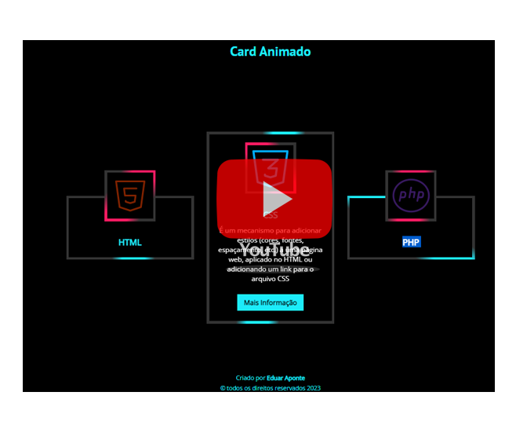

# EduarAponte-Card-Animado-com-CSS


Projeto criado com o objetivo de colocar em prática os conhecimentos em CSS e HTML.

<br>

<div align="center">

  
   
</div>

<br>

# Descrição

- Um card com efeitos animados criados exclusivamente com CSS e HTML, colocando em prática alguns conhecimentos do dia-a-dia de CSS.

### Declarando variáveis CSS globais.
- O :root pode ser útil para declarar uma variável CSS global.
- Exemplo:
```
:root {
  --cor-body: red;
  --pane-padding: 5px 42px;
}
```
### ::before
- Em CSS o ::before cria um pseudo-elemento que é o primeiro filho do elemento atingido. É frequentemente utilizado para adicionar conteúdo decorativo à um element utilizando a propriedade content. Este elemento é inline por padrão.
```
a::before {
  content: '';
  color: blue;
}
```
### ::after
- Em CSS o ::after cria um pseudo-elemento que é o último filho do elemento selecionado. Muitas vezes é usado para adicionar e melhorar o conteúdo de um elemento como a propriedade content. É inline por padrão.
-Exemplo:
```
a::after {
  content: '';
  color: blue;
}
```


- Quer conhecer mais visite os site de referência 

root [Clique aqui](https://developer.mozilla.org/pt-BR/docs/Web/CSS/:root)
  
before [Clique aqui](https://developer.mozilla.org/pt-BR/docs/Web/CSS/::before)
  
after [Clique aqui](https://developer.mozilla.org/pt-BR/docs/Web/CSS/::after)
  
  
<br>

# Objetivo

O principal objetivo do projeto é colocar em prática os conhecimentos em CSS para dar estilos no site.

<br>

# Ferramentas Utilizadas

- HTML
- CSS
- Visual Studio Code

<br>

# Como Testar

Você pode acessar o projeto [](https://card-animacao-css.netlify.app) ou [](https://eduaraponte.github.io/EduarAponte-)

Ou rodar na sua maquina.

```

git clone https://github.com/EduarAponte/Card-Animado-com-CSS.git

```

### Assitir o tutorial

<a href="https://youtu.be/iEHLG1osEIA" target="_blank">
  
</a>
<br>

# Observações

- Projeto para fim demonstrativo.

- o projeto esta construido utilizando as tecnologias HTML e CSS.
  <br>
  
> Status do projeto: Finalizado
<br>
O caminho das pedras para entrar no universo da programação e começar com a criação de sites utilizando as linguagens populares CSS, HTML e JavaScript.
